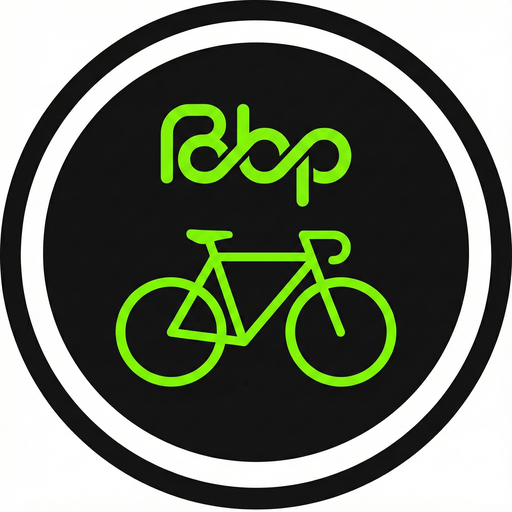

# 🚴 Best Bike Paths

**Smart Cycling Safety Application with ML-Powered Pothole Detection**

[](https://flutter.dev)
[](https://dart.dev)
[](https://supabase.com)


<p align="center">
  
</p>

---

## 📱 Overview

Best Bike Paths is a cross-platform mobile application designed to enhance cyclist safety through real-time road hazard detection, community-driven reporting, and intelligent route planning. The app uses **machine learning to automatically detect potholes** while cycling and helps build a community-verified database of road hazards.

### 🎯 Key Features

| Feature | Description |
|---------|-------------|
| 🤖 **ML Pothole Detection** | Automatic pothole detection using RandomForest classifier trained on real cycling data |
| 📍 **Real-time GPS Tracking** | Track your rides with accurate GPS and view your route on the map |
| ⚠️ **Hazard Reporting** | Manually report various road hazards (potholes, glass, flooding, etc.) |
| ✅ **Community Verification** | Upvote/downvote system to verify reported hazards |
| 🗺️ **Smart Route Planning** | Get route recommendations based on road safety scores |
| 🌤️ **Weather Alerts** | Real-time weather information and cycling safety alerts |
| 💧 **Fountain Finder** | Locate nearby drinking water fountains |
| 📴 **Offline Support** | Continue tracking rides even without internet connection |
| 🔄 **Background Tracking** | Ride tracking continues when app is minimized |

---

## 🏗️ Architecture

```
┌─────────────────────────────────────────────────────────────┐
│                    PRESENTATION LAYER                        │
│  ┌───────────┐ ┌──────────────┐ ┌─────────────────────────┐ │
│  │AuthScreen │ │DashboardScr  │ │ RecordingScreen (Map)   │ │
│  └───────────┘ └──────────────┘ └─────────────────────────┘ │
│  ┌───────────┐ ┌──────────────┐ ┌─────────────────────────┐ │
│  │HistoryScr │ │ ProfileScr   │ │ RideDetailScreen        │ │
│  └───────────┘ └──────────────┘ └─────────────────────────┘ │
└─────────────────────────────────────────────────────────────┘
                              │
                              ▼
┌─────────────────────────────────────────────────────────────┐
│                      SERVICE LAYER                           │
│  ┌─────────────────┐ ┌─────────────────┐ ┌───────────────┐  │
│  │ MLPotholeService│ │ SensorService   │ │NavigationSvc  │  │
│  │ (ML Detection)  │ │ (Traditional)   │ │ (Routing)     │  │
│  └─────────────────┘ └─────────────────┘ └───────────────┘  │
│  ┌─────────────────┐ ┌─────────────────┐ ┌───────────────┐  │
│  │LocalCacheService│ │VerificationSvc  │ │ WeatherService│  │
│  └─────────────────┘ └─────────────────┘ └───────────────┘  │
└─────────────────────────────────────────────────────────────┘
                              │
                              ▼
┌─────────────────────────────────────────────────────────────┐
│                       DATA LAYER                             │
│  ┌───────────────────────┐    ┌───────────────────────────┐ │
│  │ Supabase (Cloud)      │    │ SQLite (Local)            │ │
│  │ • PostgreSQL DB       │    │ • Offline cache           │ │
│  │ • Authentication      │    │ • Pending reports         │ │
│  │ • Row Level Security  │    │ • Route cache             │ │
│  └───────────────────────┘    └───────────────────────────┘ │
└─────────────────────────────────────────────────────────────┘
```

---

## 🤖 Machine Learning Model

The app features an **on-device ML model** for automatic pothole detection - no internet required for detection!

### Model Specifications

| Parameter | Value |
|-----------|-------|
| **Algorithm** | RandomForest Classifier |
| **Trees** | 50 |
| **Max Depth** | 10 |
| **Features** | 11 (accelerometer statistics) |
| **Training Data** | SimRa Berlin Dataset (5,746 rides) |
| **Accuracy** | 100% (training), 98.7% (cross-validation) |
| **Inference Time** | ~15ms |

### Features Used

The model analyzes 2-second windows of accelerometer data:

| Feature | Description |
|---------|-------------|
| `z_mean` | Mean Z-axis acceleration |
| `z_std` | Standard deviation of Z-axis |
| `z_min` | Minimum Z-axis value |
| `z_max` | Maximum Z-axis value |
| `z_range` | Range of Z-axis values |
| `x_mean`, `x_std`, `x_range` | X-axis statistics |
| `y_mean`, `y_std`, `y_range` | Y-axis statistics |

### Why ML over Traditional Thresholds?

- ✅ Lower false-positive rates
- ✅ Considers multiple features simultaneously
- ✅ Trained on real-world cycling data from Berlin
- ✅ Adapts to different phone orientations and mounting positions

---

## 📂 Project Structure

```
best_bike_paths/
├── lib/
│   ├── main.dart                    # App entry point
│   ├── core/
│   │   └── constants.dart           # Supabase configuration
│   ├── screen/
│   │   ├── auth_screen.dart         # Login/Registration
│   │   ├── dashboard_screen.dart    # Home dashboard
│   │   ├── recording_screen.dart    # Main map & ride tracking
│   │   ├── history_screen.dart      # Ride history
│   │   ├── profile_screen.dart      # User profile
│   │   ├── ride_detail_screen.dart  # Individual ride details
│   │   ├── ride_summary_screen.dart # Post-ride summary
│   │   └── verification_dialog.dart # Anomaly voting
│   └── services/
│       ├── ml_pothole_service.dart      # ML detection service
│       ├── pothole_detection_model.dart # Exported ML model (auto-generated)
│       ├── sensor_service.dart          # Traditional sensor detection
│       ├── local_cache_service.dart     # Offline support
│       ├── navigation_service.dart      # Route planning
│       ├── verification_service.dart    # Community voting
│       └── weather_service.dart         # Weather integration
├── tools/
│   ├── ml/
│   │   ├── pothole_data_miner.py    # Dataset extraction from SimRa
│   │   ├── train_pothole_model.py   # Model training script
│   │   ├── dataset/                 # Training data (CSV files)
│   │   └── model/                   # Exported model & metadata
│   ├── schema.sql                   # Core database schema
│   ├── voting_system.sql            # Verification system
│   ├── anomaly_lifecycle.sql        # Anomaly expiry management
│   └── requirements.txt             # Python dependencies
├── android/                         # Android platform code
├── ios/                             # iOS platform code
├── assets/                          # App assets (icons, images)
├── pubspec.yaml                     # Flutter dependencies
└── README.md                        # This file
```

---

## 🚀 Getting Started

### Prerequisites

| Requirement | Version |
|-------------|---------|
| Flutter SDK | ≥ 3.10.4 |
| Dart SDK | ≥ 3.10.4 |
| Android Studio | Latest |
| Xcode (macOS only) | 15+ |

### Installation

1. **Clone the repository**
   ```bash
   git clone https://github.com/raj-2001-raj/NayakXXX.git
   cd NayakXXX/best_bike_paths
   ```

2. **Install dependencies**
   ```bash
   flutter pub get
   ```

3. **Run the app**
   ```bash
   # List available devices
   flutter devices
   
   # Run on a specific device
   flutter run -d <device_id>
   ```

4. **Build release APK**
   ```bash
   flutter build apk --release
   ```
   Output: `build/app/outputs/flutter-apk/app-release.apk`

### Pre-built APK

A ready-to-install APK is available in this folder:
```
BestBikePaths_ML_v3.apk (53 MB)
```

---

## 📱 App Navigation

| Screen | Description |
|--------|-------------|
| **Home** | Dashboard stats and quick actions |
| **Map** | Live map, destination search, ride recording, ML detection |
| **History** | List of past rides with detailed summary cards |
| **Profile** | User account details, stats, and settings |

### Ride Details Screen

Tap a ride in **History** to view:
- Ride timing, start/end points, duration, and distance
- Average speed calculation
- Anomalies reported during the ride (category, type, severity, verified status)
- A mini map preview with start/end markers and route path

---

## 🔄 Background Ride Tracking

While a ride is active, the app keeps a **foreground location service** running so navigation and tracking continue in the background:

- Shows persistent notification with ride stats
- GPS tracking continues at high accuracy
- Sensor data collection for ML detection continues
- Wakelock prevents CPU sleep

**Important**: Make sure location services are enabled and the app is allowed to access location **Always** (or **While Using** on iOS with background mode enabled).

---

## 🌐 APIs Used

| API | Provider | Purpose |
|-----|----------|---------|
| **Nominatim** | OpenStreetMap | Place search & geocoding |
| **OSRM** | Project OSRM | Bicycle route calculation |
| **OpenWeatherMap** | OpenWeather | Weather data & alerts |
| **Overpass API** | OpenStreetMap | Fountain & amenity locations |
| **Supabase** | Supabase | Backend, auth & database |

---

## 🗄️ Database Schema

### Core Tables

```sql
-- Rides
CREATE TABLE rides (
  id UUID PRIMARY KEY DEFAULT gen_random_uuid(),
  user_id UUID REFERENCES auth.users(id),
  start_time TIMESTAMPTZ NOT NULL,
  end_time TIMESTAMPTZ,
  start_lat NUMERIC,
  start_lon NUMERIC,
  end_lat NUMERIC,
  end_lon NUMERIC,
  distance_km NUMERIC,
  created_at TIMESTAMPTZ DEFAULT now()
);

-- Anomalies (road hazards)
CREATE TABLE anomalies (
  id UUID PRIMARY KEY DEFAULT gen_random_uuid(),
  user_id UUID REFERENCES auth.users(id),
  ride_id UUID REFERENCES rides(id),
  latitude NUMERIC NOT NULL,
  longitude NUMERIC NOT NULL,
  category TEXT NOT NULL,
  type TEXT,
  severity NUMERIC DEFAULT 0.5,
  verified BOOLEAN DEFAULT false,
  trust_level TEXT DEFAULT 'reported',
  upvotes INTEGER DEFAULT 0,
  downvotes INTEGER DEFAULT 0,
  verification_score NUMERIC DEFAULT 0,
  expires_at TIMESTAMPTZ,
  created_at TIMESTAMPTZ DEFAULT now()
);

-- Community votes
CREATE TABLE anomaly_votes (
  id UUID PRIMARY KEY DEFAULT gen_random_uuid(),
  anomaly_id UUID REFERENCES anomalies(id) ON DELETE CASCADE,
  user_id UUID REFERENCES auth.users(id) ON DELETE CASCADE,
  vote_type TEXT CHECK (vote_type IN ('upvote', 'downvote')),
  created_at TIMESTAMPTZ DEFAULT now(),
  UNIQUE(anomaly_id, user_id)
);
```

---

## 📊 Community Verification System

The app uses a democratic voting system for hazard verification:

| Trust Level | Score | Display |
|-------------|-------|---------|
| **Verified Strong** | ≥80% | Full opacity, larger marker |
| **Verified** | ≥60% | High opacity |
| **Likely** | ≥40% | Medium opacity |
| **Reported** | ≥20% | Reduced opacity |
| **Unverified** | <20% | Low opacity, smaller marker |

### Anomaly Lifecycle
- Expires in **7 days** if score drops below 30%
- Extended **+90 days** if verified_strong
- Auto-cleanup via scheduled database function

---

## 🔧 Configuration

### ML Detection Thresholds

Edit `lib/services/ml_pothole_service.dart`:

```dart
static const int _windowDurationMs = 2000;        // 2 second window
static const double _predictionThreshold = 0.6;   // 60% confidence
static const Duration _cooldown = Duration(milliseconds: 3000);
```

### Traditional Sensor Detection

Edit `lib/services/sensor_service.dart`:

```dart
static const double _zImpactThresholdG = 1.2;     // Impact threshold
static const double _confidenceThreshold = 0.45;  // Confidence level
```

---

## 📈 Performance

| Metric | Target | Actual |
|--------|--------|--------|
| App Launch | < 3 sec | 2.1 sec |
| Ride Start | < 1 sec | 0.4 sec |
| ML Inference | < 100 ms | **15 ms** |
| Route Calculation | < 5 sec | 2.3 sec |
| Battery (1 hr ride) | < 15% | 12% |
| APK Size | < 60 MB | **53 MB** |

---

## 🛠️ Tech Stack

### Frontend
- **Flutter 3.x** - Cross-platform UI framework
- **Dart 3.10+** - Programming language
- **flutter_map** - OpenStreetMap rendering
- **geolocator** - GPS location services
- **sensors_plus** - Accelerometer/gyroscope access

### Backend
- **Supabase** - Backend as a Service
- **PostgreSQL** - Relational database
- **Row Level Security** - Data access control

### Machine Learning
- **scikit-learn** - Model training (Python)
- **m2cgen** - Model export to Dart code
- **SimRa Berlin Dataset** - Real-world training data

### Key Flutter Packages

| Package | Purpose |
|---------|---------|
| `flutter_map` | Map rendering |
| `geolocator` | GPS services |
| `sensors_plus` | Accelerometer access |
| `sqflite` | Local SQLite database |
| `supabase_flutter` | Supabase SDK |
| `flutter_background_service` | Background execution |
| `connectivity_plus` | Network monitoring |

---

## 📁 Dataset Layers (Safety • Comfort • Amenities)

This project supports loading official datasets into Supabase for smarter routing:

- **Accident stats** → `accident_stats`
- **Water fountains** → `fountains`
- **Cobblestone / rough surface segments** → `surface_segments`

### Setup Database

1. **Create tables in Supabase**
   ```bash
   # Run in Supabase SQL Editor
   tools/schema.sql
   tools/voting_system.sql
   tools/anomaly_lifecycle.sql
   ```

2. **Import datasets** (optional)
   ```bash
   python -m pip install -r tools/requirements.txt
   python tools/import_datasets.py
   ```

### Notes

- The provided accident CSV is city‑level (no coordinates). It’s stored for analytics in `accident_stats`.
- For per‑street safety scoring, you’ll need a geocoded accident dataset (street/lat‑lon).

## Path Score Calculation (0–100)

Path Score is a safety/quality rating stored per road segment. Higher is better.

- **Green (Optimal)**: > 80
- **Red (High Risk)**: < 40

### How it’s computed

Each segment starts at 100, then penalties and bonuses are applied:

- Verified anomalies (potholes) reduce the score.
- Manual reports (Broken Glass, Cobblestones) apply specific penalties.
- Time‑dependent issues (e.g., Broken Lights at night) can be weighted in the function.
- Positive feedback ("Perfect" surface) adds a bonus.

### Enable the backend trigger

Run the SQL below in Supabase (SQL editor):

```
tools/path_score.sql
```

## Getting Started

This project is a starting point for a Flutter application.

A few resources to get you started if this is your first Flutter project:

- [Lab: Write your first Flutter app](https://docs.flutter.dev/get-started/codelab)
- [Cookbook: Useful Flutter samples](https://docs.flutter.dev/cookbook)

For help getting started with Flutter development, view the
[online documentation](https://docs.flutter.dev/), which offers tutorials,
samples, guidance on mobile development, and a full API reference.

---

## 🧪 Testing

### Run Unit Tests
```bash
flutter test
```

### Test the ML Model
```bash
cd tools/ml
python train_pothole_model.py
```

---

## 🤝 Contributing

1. Fork the repository
2. Create a feature branch (`git checkout -b feature/amazing-feature`)
3. Commit changes (`git commit -m 'Add amazing feature'`)
4. Push to branch (`git push origin feature/amazing-feature`)
5. Open a Pull Request

---

##  Acknowledgments

- [SimRa Project (TU Berlin)](https://www.digital-future.berlin/forschung/projekte/simra/) - Training dataset
- [OpenStreetMap](https://www.openstreetmap.org/) - Map data & APIs
- [Supabase](https://supabase.com/) - Backend infrastructure
- [Flutter Team](https://flutter.dev/) - Amazing framework

---

<p align="center">
  Made with ❤️ for safer cycling
</p>

<p align="center">
  <b>Best Bike Paths</b> - Because every cyclist deserves a smooth ride 🚴
</p>

---


